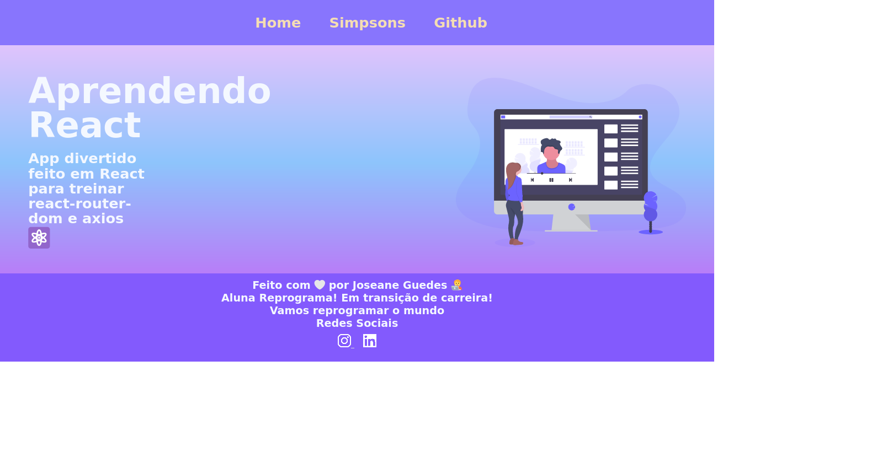

<h1 align="center"> Terceiro Projeto React ⚛️ </h1>

### Projeto divertido desenvolvido sob coordenação da Professora Simara - Ex-aluna {reprograma}, desenvolvedora na ThoughtWorks e criadora do Podcast Quero Ser Dev.

  

## :hammer_and_wrench: Tecnologias utilizadas:
* Reactjs
* HTML5
* JavaScript
* CSS3
* Axios
* Node.js

Projeto feito com 💙 por Joseane Guedes @ Reprograma

